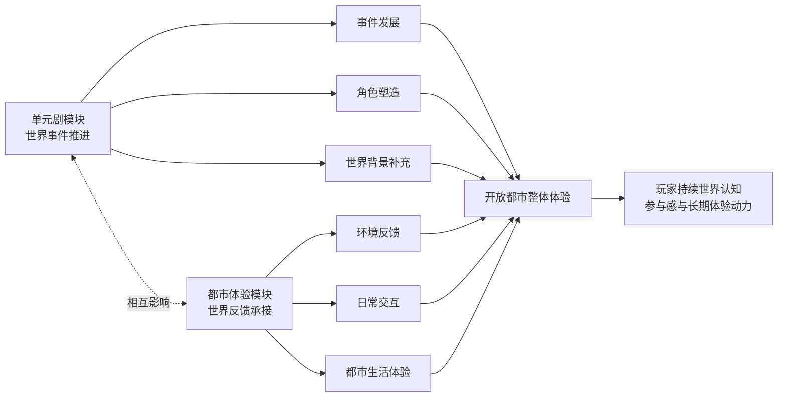
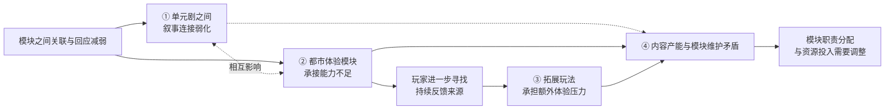
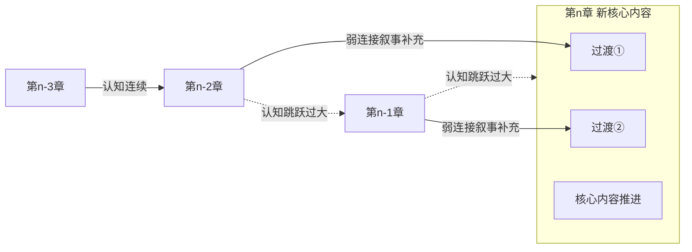

#异环

## 思考来源

在现代游戏内容架构设计中，模块化已经逐渐成为较常见的内容组织方式。

通过将大型世界内容拆分为多个相对独立的模块，可以降低单次内容开发的复杂度，便于进行版本更新、内容拓展、世界观补全等体验设计。同时也能在一定程度上减轻玩家对每个阶段的情节理解负担。

然而，模块化构造设计方式虽然具有较强的构建优势，但实际上其内部容易暗藏着许多较为隐蔽的问题：

- 模块之间关联感弱化造成的体验断裂
- 整体世界观与配套辅助内容易脱节
- 部分拓展类玩法与核心内容关联弱导致目标感降低
- 部分模块化配套资源平均利用程度低

这些问题可能会削弱玩家对于整体世界的持续感知，使内容从“推动世界发展的组成部分”逐渐转变为“独立存在的内容单元”。

因此，如何在保持模块独立性的同时维持整体体验连续，在我看来是模块化设计之中需要长期关注并不断调整的问题。

---
## 具体思考来源对象

本次思考主要来源于个人在游玩《异环》近期1.1与1.2版本体验过程中所产生的观察。

从早期测试阶段和1.0，再到体验后续1.1与1.2版本内容时，从个人的体验角度出发，我逐渐感受到对于新版本内容的期待与主动体验感有所降低。

因此，以该游戏作为观察对象，并从其中的一些体验上的变化，进一步拆解其模块化内容在长期拓展过程中会逐渐暴露出来的问题。

## 从《异环》核心内容架构拆解出发

#### 1. 从单元剧结构上出发

《异环》是一款主要以开放都市为核心，并围绕都市中的不同事件，通过多个单元剧逐步补充和构建整体世界内容的游戏。

其宣传内容本身也将“单元剧”作为主要叙事方式之一，即将原本具有长线发展性质的剧情内容，拆分为多个相对独立、但彼此之间仍保留一定连续性的短线剧情进行呈现。

因此，从整体内容来看，《异环》本身并非单纯依靠一条持续向前推进的长线主线来完成世界构建，而是通过不同单元内容的持续补充与相互回应的方式，逐渐在玩家的意识中构筑出一整个关于都市、角色关系以及世界故事背景的认识。

所以，单元剧在这其中既承担着角色塑造与登场、同时也在不断推进世界观以及都市的变化体验。

#### 2. 从模块化配套体验内容出发

除了单元剧作为主要的内容推进方式外，《异环》的整体体验还依赖于围绕都市所构建的一系列配套内容与玩法，例如：

- 都市拓展玩法
- 限时活动内容
- 日常交互体验
- 都市生活反馈

这些模块化配套内容的作用，使玩家从“剧情带入者”转变为“都市参与者”的作用，让开放都市不只是作为单元剧的承接背景板，而是成为玩家能持续从中收获到更接近持续的世界反馈体验。

同时，从模块化内容构建角度来看，这些内容极大的丰富了整个世界的可玩性与拓展性，从而避免了开放都市体验中过于单一化的交互内容形式。

#### 二者之间的相互作用

单元剧模块用于推动整体世界事件的发展，使玩家通过具体的故事情节逐渐认识角色关系以及完整的世界背景

而模块化配套体验内容负责在这个过程中承接这些变化，让玩家在单元剧之外，仍能持续感受到整个都市世界所带来的完整体验的反馈。

虽然二者在功能上存在着一定的差异，但从整体结构上来观察，<mark>二者实际上共同构建了一个可体验的、具有持续性反馈机制的开放都市世界</mark>，能从中不断维持玩家对于世界的持续认知、参与感以及长期体验动力。

## 模块化推进中的隐性问题

在拆解完核心内容架构之后，我们会发现：

在理想的状态下，各个独立的内容模块能够相互交织、相互回应，确实能够实现一个可体验的、具有持续性反馈机制的开放都市。例如：《异环》多次内测阶段以及1.0上线版本的时候，我们确实可以明显的感受到这种体验。

但是，模块化的隐性问题也恰恰出现在这里。

不同内容模块不断新增，但当不同内容模块之间缺少足够的关联与回应时，即使单个模块中的内容能提供完整的体验感，也可能导致整体世界体验感逐渐出现断层，使玩家对于世界连续性的认知产生下降。

而当模块之间的关联逐渐减弱时，这种影响并不会仅表现为单一问题，而是会随着玩家体验重心的转移，以及不同内容模块承担职责的变化，逐渐扩散至多个方面。具体来看的话，主要体现在以下几个方面：

#### 1. 单元剧之间的叙事连接弱化

在《异环》的内容架构之中，单元剧作为其推进主世界发展的主要方式，不仅仅承担着单个事件的叙述功能，同时还用于补充角色关系、世界背景以及后续发展所需要的内容等等。

正如我们最前面对“核心内容架构拆解”中所提及的内容一样：将原本具有长线发展性质的完整故事，通过拆分为多个相对独立、但彼此之间仍保留一定连续性的短线剧情进行呈现。

因此，在假设理想状况之下，每个单元剧之间的角色关系、事件发展以及世界信息都是建立在原有世界发展基础之上，也就是说建立在玩家原有的对这个世界的理解与认知。

但是随着不断扩增新内容、新单元剧时，每个相对独立的单元剧之间开始缺少足够承接的信息时，则会让整体叙事之间的关连性逐渐减弱。从而会产生单个单元剧内部内容足够丰富，但整体连接性逐渐减弱的情况。

最终，这种问题就会导致玩家确实能够完整的体验单个故事内容，但对于这些单元剧在整体推进中的作用，以及世界发展的方向逐渐失去清晰认知。使不同事件之间的关联关系变得模糊，并产生理解上的割裂感。

如该章节开头所提及到的，《异环》早期版本（从测试到1.0版本前后）中，各个单元剧之间确实做到了通过角色关系、事件线索以及世界背景进行相互回应，形成了较为完整的内容承接关系，能让玩家持续建立对于整体世界发展的认知。
但随着后续版本（从个人体验观察，从1.1左右开始到1.2，以“木偶”剧情往后部分）内容增加，单个单元剧内部虽仍能提供相对完整的体验，但由于前后内容之间的连接关系有所下降，从而使玩家难以梳理清楚这些事件对于整体世界发展的推动作用以及先后逻辑顺序。

所以，单元剧结构本身并不是导致其体验下降的主要因素，真正影响其整体体验连续性的，是各单元之间是否能持续形成有效的连接与回应。

#### 2. 都市体验模块的承接能力不足

当单元剧作为核心内容推进方式时，其本身承担着玩家的主要体验目标。因此在核心单元剧持续推进阶段，其本身提供的剧情目标以及世界信息，已经吸引了玩家大部分注意力，所以玩家对于额外的都市配套模块内容需求相对较低。

但是，当核心剧情内容暂时结束，或是单元剧无法持续提供新的内容目标与世界推进体验时，玩家的体验重心便会逐渐从剧情推进转向开放都市本身的“都市体验模块”部分，寻找新的持续反馈来源。

也因此导致原有的都市体验模块需要承担比设计初期预期更多的、维持玩家参与感的职责。

然而，绝大多数的都市体验模块在设计之初的定位就并非如此，当其本身缺少足够的反馈机制时，即便开放都市拥有较大空间规模和丰富配套资源，也难以形成玩家参与的核心动力。

且当原有的都市体验模块在承担了过大的职责之后，其本身存在的问题也会被进一步放大，最终影响玩家整体体验。

从《异环》来看，其开放都市体验的核心价值在于：通过环境反馈、随机事件以及日常行为等方式，让玩家持续建立与都市之间的联系。例如，场景中的交互反馈能增强玩家对于场景变化的感知；突发事件能够让城市更加具体化；而日常任务、城市服务等固定玩法，则能让玩家以更接近于生活化的方式沉浸其中。但由于其本身的职责区分较为明显，因此当玩家注意力转移至都市模块后，自然会被赋予更多的反馈期待。

所以，都市模块的问题不是内容不足，而是在核心内容的注意力转移至其身上时，被迫承担超过其原设计职责的体验压力。

#### 3. 拓展玩法逐渐承担额外体验压力

在游戏内容架构中，拓展玩法通常并不承担推动核心世界发展的主要职责，而是作为核心内容之外的补充模块，用于丰富玩家体验、提供阶段性内容变化以及延长玩家参与周期。

因此对于拓展玩法来说，其职责与生命周期相较于前面的“单元剧模块”以及“都市体验模块”来说，定位其更加明显的用于短暂提供足够的新鲜感以及分担玩家对于单一内容模块的关注压力，以此在特定阶段提升版本内容丰富度。

然而，当前面我们所提及到的核心内容（“单元剧模块”）无法持续提供新的体验目标，同时“都市体验模块”也无法充分承接玩家需求时，玩家此时会自主寻找能够提供持续反馈的其他内容。

这里我们所提及的拓展玩法的职责，就在于阶段性的为玩家提供短暂的新鲜感和补充核心内容不足时产生的阶段性体验空缺。因此，游戏中的拓展玩法便成为了玩家们下一目标，从而玩家体验中心会逐渐转移至拓展玩法。

但由于我们前面提到了两个模块都无法承接玩家的需求，此时体验便会过度倾倒至拓展玩法上，从而造成拓展玩法逐渐承担超出其原本定位的体验压力。

然而，拓展玩法自身具有较为明确的生命周期，其主要作用仍然是提供阶段性的体验补充。所以当拓展玩法内容消费完后，玩家又会转头回归常驻内容从而寻找长期体验来源。但此时都市体验模块仍然无法完全承接玩家需求，因此形成对于新内容持续依赖的情况。

在《异环》中，后续版本逐渐增加更多更丰富的活动内容，如竞速类玩法、挑战玩法以及休闲玩法活动（例如后续版本中的“格斗争霸赛”、“黑暗赛车界”、“直立麻将”等活动内容）。这些内容本身能够通过新的玩法形式为玩家提供阶段性的体验刺激，在一定程度上丰富了版本内容。
但是从整体内容架构来看，这些活动所能提供的持续性反馈，相较于开放都市、世界内容推进而言相对有限，且其对于核心世界线推进以及长期角色塑造的影响相对有限。因此，玩家在完成活动内容后，活动本身主要承担阶段性体验补充职责，因此对于后续世界发展的推动能力相对有限。
这也导致了拓展玩法虽然能暂时缓解玩家对内容不足的需求，但无法真正替代核心内容所提供的持续反馈。

#### 4. 内容产能与各模块维护之间的矛盾

在前文中，我们已经明确过，模块化设计方式在一定程度上确实能降低单个内容的生产与开发难度。但随着模块数量增加，不同模块之间潜在的关联关系数量也会同步提升，因此对于内容衔接、世界状态变化以及体验反馈的维护也会进一步增加。

前面三个问题中，我们可以发现其实这当中的核心矛盾并不在于某个内容模块本身不足，而是在于当玩家体验需求转变时，其各模块之间承担的职责是否还能足够满足其需求。因此，这三个问题并非完全独立存在，而是在模块之间相互作用关系弱化后，分别从不同层面表现出来。

而模块化设计中真正需要关注的，并不仅仅是单个模块内容的丰富度，而是不同模块之间职责分配以及相互连接方式是否能够长期维持。

但这当中的维护，并不能简单地对所有模块平均投入资源，因为在实际开发中，可用于投入维护的资源并不是无限多的。因此，未准确衡量并分配各模块所须投入的维护资源，则可能进一步影响整体体验结构。

举个例子，对于《异环》这类以开放都市为核心的内容架构来说，各类模块的职责并非完全相同。其中，单元剧模块作为推动世界发展以及维持整体叙事连续性的核心内容，其与角色塑造、世界背景以及后续事件之间的连接维护，应当属于优先级较高的部分。

而都市体验模块虽同样承担着维持玩家参与感的重要作用，但其核心职责更多服务于世界变化过程，并通过环境反馈强化玩家对于都市的感知，因此该部分模块虽然与单元剧承担的职责不同，但也属于维系整个都市发展的核心要素。

最后则是拓展玩法，由于前面提及到其自身生命周期以及定位限制，使其更适合作为阶段性的体验补充而非长期反馈来源，但这样并不代表其优先级在最低点，相反，拓展玩法在特定阶段所承担的体验价值，甚至可能接近于都市常驻体验模块。例如在核心内容更新过渡阶段时间较长，拓展玩法能够有效的缓解玩家对于新的内容的需求，此时其阶段性价值会明显抬升。

因此，模块化设计中的资源分配并不是简单的按照模块数量或者内容规模进行分配，而是需要根据不同阶段的玩家需求以及模块职责进行动态调整。

如果忽视这种差异，将所有资源投入到短期反馈内容中，可能会使核心内容连接维护不足，从而造成最开始所谓的叙事连接弱化；而如果过度集中资源于未来的大型内容开发，也可能导致玩家在内容间隔期间缺少足够的世界反馈与参与动力。

## 个人的理解、猜想与解决思路

##### 猜想与理解

通过以上的内容可以发现，模块化设计本身并不是导致体验连续性割裂的原因。真正的问题在于，当整体内容被拆分为多个独立模块后，如何保证各模块之间仍能维持有效的回应与联系。

对于单元剧结构而言，拆分本身能够降低玩家理解压力，也能降低开发过程中的内容组织难度。但与此同时，拆分后的每个单元并不会天然的成为完全独立的个体。

尤其当某些单元承担角色塑造、世界背景补充以及后续事件铺垫时，即使其被定义为“番外”或”额外内容“，玩家仍然会下意识将其视为整体故事理解中的一部分。

##### 当核心内容出现认知断层后如何重新建立玩家联系

前文中提到，模块化内容最大的问题并不是数量增加，而是当不同内容模块之间缺少足够的关联与回应，从而导致玩家在理解世界变化时出现认知断层。

因此，对于已上线并产生认知断层的内容来说，重新修改原有核心内容显然并不现实。相比重新构建原有叙事结构，更可行的方式是在后续内容中增加必要的过渡衔接内容，使玩家能够重新理解不同事件之间的关联，并逐渐恢复对于整体世界发展的认知。

这里所提到的过渡衔接内容，并不承担替代核心剧情推进的职责，而更多是作为不同阶段之间内容上的弱连接。同时，该方式更适用于核心单元剧内容或其之间的连接修复，而不适合作为解决所有模块问题的通用方式。否则会导致原本应由核心内容承担的信息被过度分散，使得玩家反而还需要更多额外内容才能理解整体发展，从而降低叙事效率。

例如，当核心单元剧之间存在较大的时间跨度或世界状态变化时，可以在后续新增内容中，将部分必要信息重新组织为少量过渡节点，从而使玩家逐渐完成对原来世界变化的理解。同时在这之中，还可以充分灵活运用部分模块化配套资源，从而提高资源平均利用程度。

以下是逻辑图例：

其中过渡节点并非独立内容模块，而是依附于核心单元剧，用于补充不同阶段之间缺失的信息连接。

总体而言，模块化设计真正需要维护的并不是模块数量本身，而是不同模块之间持续存在的联系。对于已经产生认知断层的内容，通过弱连接内容补充变化过程，可以在不重构原有内容的情况下，帮助玩家重新建立对于整体世界发展的理解。

而从长期设计角度来看，则需要在内容规划阶段提前考虑模块之间的连接关系，避免内容扩展后逐渐形成孤立的信息单元才是更合理的选择。

